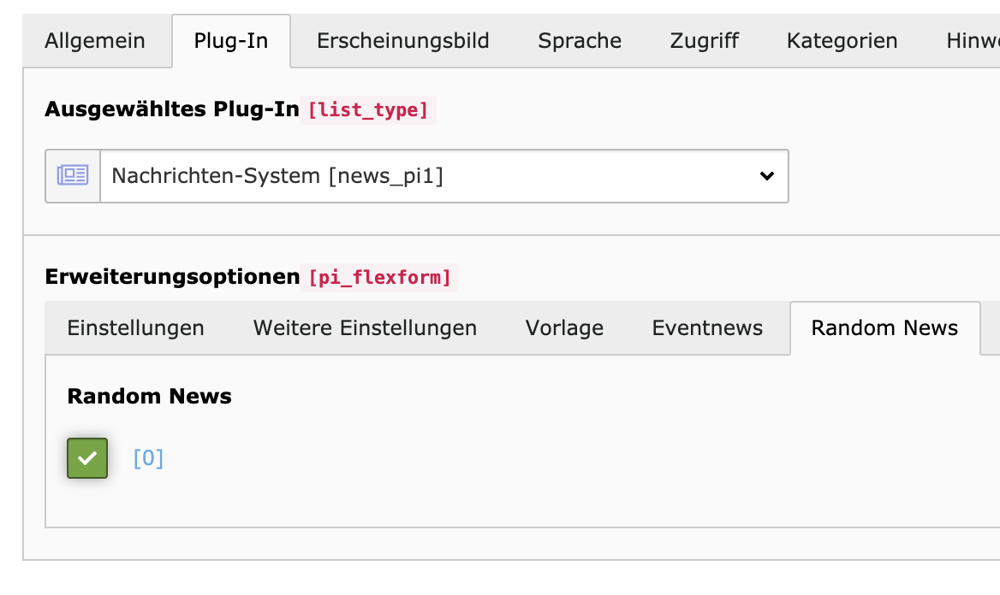

# TYPO3 Extension `news_random`

This extension creates a random ordering of news records.

## Usage

After installing the extension the plugin configuration is extended by an additional 
tab with a new checkbox **Random News**. 

Enable the checkbox **and set a limit** in the plugin, otherwise the random feature won't work.

### About caching

This extension does not change the caching behaviour. If the page is cached, the random news will be cached as well. 
To have different news items per request, disable the caching for this page or set the cache time to e.g. 1 minute.

### Sorting

Even though random news are randomly picked, the sorting stays the same. To optimize the randomness if the pool of articles is too small I
I suggest to shuffle the provided articles by using JavaScript or a custom ViewHelper.
